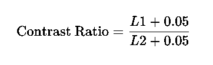

# AbleShade: A VS Code Theme for Visual Accessibility

**AbleShade** is a meticulously crafted Visual Studio Code theme designed with special attention to users with visual impairments and color blindness. Its primary goal is to provide a pleasant coding experience without straining the eyes, ensuring that code remains accessible and easy to distinguish.

## Key Features:

- **Visual Accessibility**: Created with the input of the visually impaired community to ensure it caters to their needs effectively.
  
- **Daltonism Friendly**: Colors are chosen with care to ensure they are distinguishable by those with various forms of color blindness.
  
- **Soft Visibility**: While maintaining high contrast ratios for clarity, the colors are intentionally subdued to reduce eye strain and provide a soothing coding environment.

## Installation:

1. Open **Extensions** sidebar panel in VS Code. `View → Extensions`.
2. Search for `AbleShade`.
3. Click **Install**.
4. Click **Reload**.
5. File > Preferences > Color Theme > **AbleShade**.

## Recommended Fonts

For an optimal coding experience with the AbleShade theme, we recommend using one of the following fonts:

### Hack

Hack is a typeface designed for source code. It is highly legible and helps make your code look both beautiful and clear. It's especially optimized for legibility at commonly-used source code text sizes.

- [**GitHub Repository**](https://github.com/source-foundry/Hack)
- [**Download Hack**](https://sourcefoundry.org/hack/)

### Fira Code

Fira Code is a free monospaced font containing ligatures for common programming multi-character combinations. It's an extension of the Fira Mono font family and introduces a great coding experience, especially if you enjoy ligatures in coding.

- [**GitHub Repository**](https://github.com/tonsky/FiraCode)
- [**Download Fira Code**](https://github.com/tonsky/FiraCode/releases/latest)

We believe that using these fonts with the AbleShade theme will enhance your coding experience, offering both aesthetics and functionality.

## Understanding Contrast

Contrast is the difference in luminance or perceived brightness between two colors. A higher contrast between text and its background makes the text more readable. This is especially crucial for users with visual impairments or color blindness.

### Contrast Ratio

The contrast ratio is a mathematical representation of the difference in brightness and color between the foreground (e.g., text) and background. It's calculated using the following formula:

Where:
- \( L1 \) is the relative luminance of the lighter color.
- \( L2 \) is the relative luminance of the darker color.

### Recommended Contrast Ratios

For optimal readability and accessibility:
- Normal text should have a minimum contrast ratio of 4.5:1 against its background.
- Large text (14-point bold or 18-point regular and above) should have a minimum contrast ratio of 3:1.

### AbleShade's Commitment to Contrast

In designing AbleShade, we ensured that all text tokens have a contrast ratio that meets or exceeds these recommendations. Our primary goal was to cater to a wide range of users, including those with visual impairments or color blindness. By adhering to these standards, we aim to provide a comfortable and inclusive coding environment for everyone.

## Feedback and Contributions:

We highly value the feedback from our users. If you have suggestions or encounter any issues, please [open an issue on GitHub](#Your-GitHub-Repository-Link-Here). Contributions to enhance the theme are always welcome!
